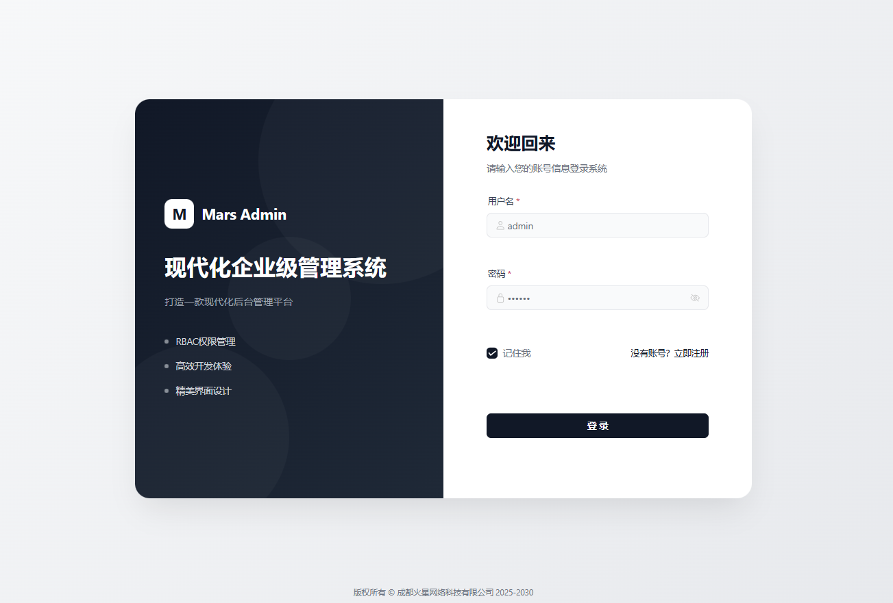
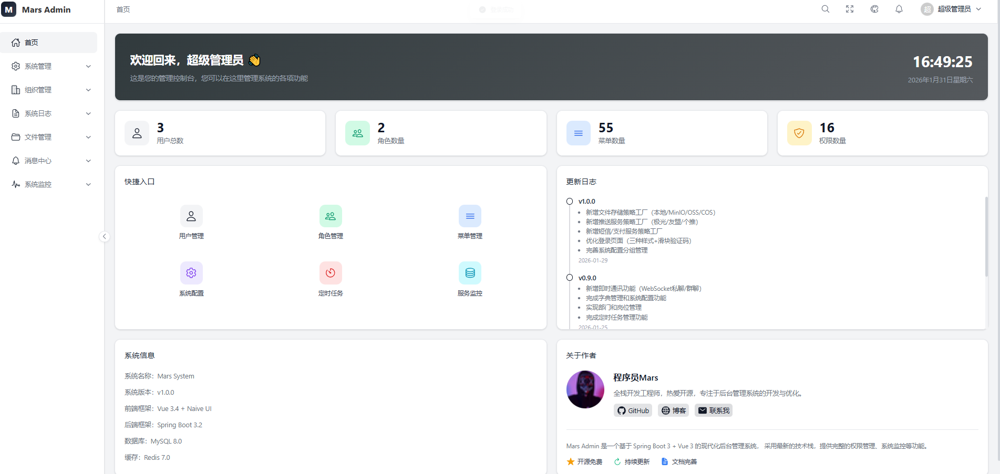
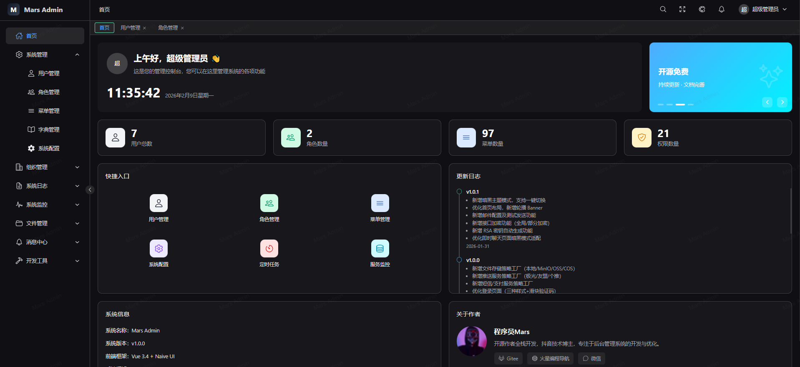
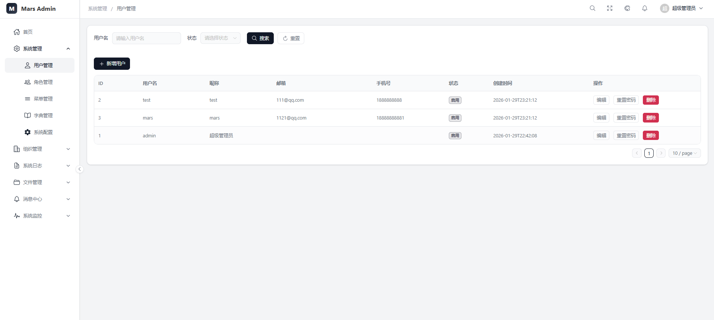
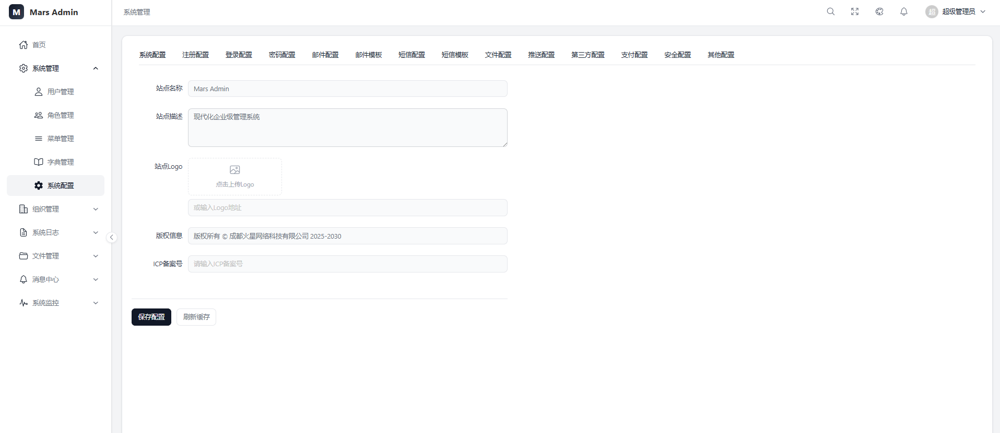
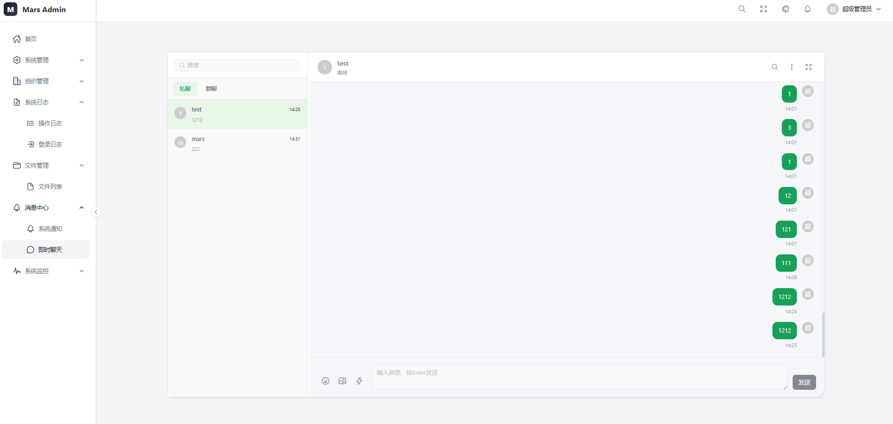
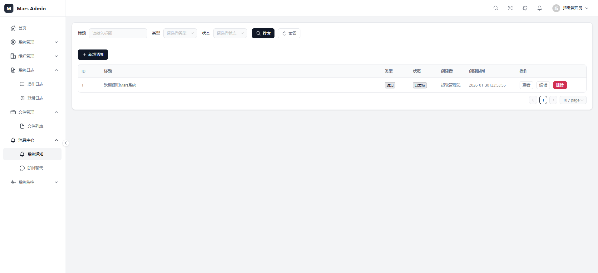
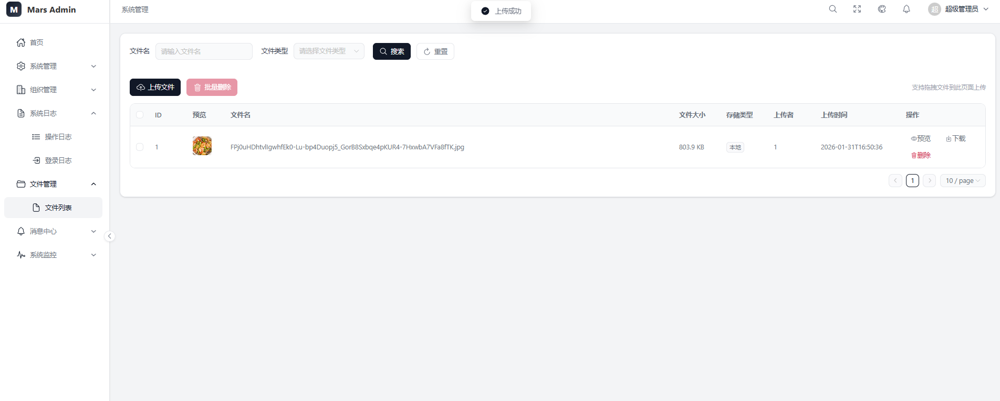
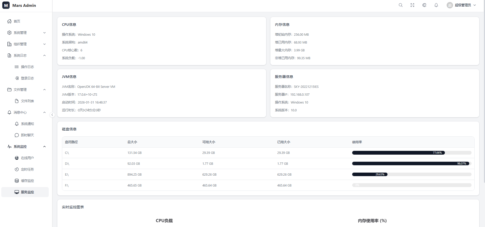

<div align="center">

# Zion Admin


**基于 Spring Boot 3 + Vue 3 的现代化后台管理系统**

[在线预览](https://Zionadmin.cn/) | [开发文档](#开发指南) | [问题反馈](https://github.com/Zionfactory/zion-system/issues)

</div>

## 在线演示

**演示地址：** [https://Zionadmin.cn/](https://Zionadmin.cn/)

**【火星编程导航】学编程做项目：** [https://Zion-coder.cn/](https://Zion-coder.cn/)

| 账号 | 密码 | 说明 |
|------|------|------|
| admin | admin123 | 管理员账号（演示模式，部分操作受限） |

> 也可以自行注册账号体验完整功能

---

## 项目简介

Zion Admin 是一个开箱即用的企业级后台管理系统，采用前后端分离架构，提供完整的权限管理、系统监控、消息推送、即时通讯等功能。项目采用分层架构设计，代码规范、结构清晰，适合作为企业后台管理系统的基础框架。

## 技术栈

### 后端

| 技术 | 版本 | 说明 |
|------|------|------|
| Spring Boot | 3.2.2 | 基础框架 |
| MyBatis-Plus | 3.5.5 | ORM 框架 |
| Sa-Token | 1.37.0 | 权限认证框架 |
| Redis | 7.0+ | 缓存/会话存储 |
| MySQL | 8.0+ | 数据库 |
| Quartz | 2.3.2 | 定时任务框架 |
| Hutool | 5.8.25 | Java 工具类库 |
| MinIO | - | 对象存储（可选） |
| 阿里云 OSS | - | 对象存储（可选） |

### 前端（PC 管理后台）

| 技术 | 版本 | 说明 |
|------|------|------|
| Vue | 3.4.15 | 前端框架 |
| Vite | 5.0.11 | 构建工具 |
| TypeScript | 5.3.3 | 类型安全 |
| Naive UI | 2.37.3 | UI 组件库 |
| Pinia | 2.1.7 | 状态管理 |
| Vue Router | 4.2.5 | 路由管理 |
| Axios | 1.6.5 | HTTP 客户端 |
| ECharts | 6.0.0 | 图表库 |
| xterm.js | 6.0.0 | 终端模拟器 |

### 移动端（小程序）

| 技术 | 版本 | 说明 |
|------|------|------|
| UniApp | - | 跨平台框架 |
| uView Plus | 3.3.36 | UI 组件库 |
| crypto-js | 4.2.0 | 加密工具 |

## 项目结构

```
zion-admin
├── zion-common              # 公共基础模块
│   ├── entity               # 基础实体类
│   ├── exception            # 全局异常处理
│   ├── result               # 统一响应封装
│   └── util                 # 工具类
│
├── zion-infra               # 基础设施层
│   ├── zion-db              # 数据库配置
│   ├── zion-redis           # Redis 配置
│   ├── zion-oss             # 文件存储（本地/MinIO/阿里云OSS）
│   ├── zion-sms             # 短信服务（阿里云/腾讯云）
│   ├── zion-pay             # 支付服务（微信/支付宝）
│   ├── zion-push            # 推送服务（极光/友盟/个推）
│   ├── zion-social          # 社交登录（微信/支付宝/苹果）
│   ├── zion-wechat          # 微信公众号/小程序
│   ├── zion-websocket       # WebSocket 支持
│   └── zion-crypto          # 加密解密
│
├── zion-core                # 业务核心层
│   ├── zion-system          # 系统管理
│   │   ├── entity           # 系统实体（用户、角色、菜单等）
│   │   ├── mapper           # MyBatis Mapper
│   │   ├── service          # 服务层
│   │   ├── annotation       # 自定义注解
│   │   └── aspect           # AOP 切面
│   ├── zion-auth            # 认证授权
│   │   ├── strategy         # 登录策略（密码/短信/社交/小程序）
│   │   └── enums            # 枚举定义
│   ├── zion-file            # 文件管理
│   ├── zion-gen             # 代码生成
│   └── zion-message         # 消息中心（公告/聊天/群聊）
│
├── zion-api                 # 接口层
│   ├── zion-admin-api       # 后台管理接口
│   │   └── controller
│   │       ├── auth         # 认证接口
│   │       ├── system       # 系统管理接口
│   │       ├── monitor      # 系统监控接口
│   │       ├── message      # 消息接口
│   │       ├── file         # 文件接口
│   │       └── gen          # 代码生成接口
│   ├── zion-app-api         # APP 接口
│   └── zion-web-api         # 网页端接口
│
├── zion-job                 # 定时任务模块
│   ├── entity               # 任务实体
│   ├── service              # 任务服务
│   └── util                 # Quartz 工具类
│
├── zion-starter             # 启动入口
│   └── resources
│       ├── application.yml
│       ├── application-dev.yml
│       └── application-prod.yml
│
├── zion-ui                  # 后台管理前端
│   ├── src
│   │   ├── api              # API 接口定义
│   │   ├── components       # 公共组件
│   │   ├── layout           # 布局组件
│   │   ├── router           # 路由配置
│   │   ├── stores           # Pinia 状态管理
│   │   ├── utils            # 工具函数
│   │   └── views            # 页面组件
│   │       ├── dashboard    # 控制台
│   │       ├── system       # 系统管理
│   │       ├── monitor      # 系统监控
│   │       ├── log          # 日志管理
│   │       ├── message      # 消息中心
│   │       ├── org          # 组织管理
│   │       └── tool         # 系统工具
│   └── package.json
│
├── zion-uniapp              # 移动端小程序
│   ├── pages
│   │   ├── login            # 登录页
│   │   ├── index            # 首页
│   │   ├── chat             # 私聊
│   │   ├── group-chat       # 群聊
│   │   ├── contacts         # 联系人
│   │   ├── group            # 群组管理
│   │   └── profile          # 个人中心
│   └── utils                # 工具类
│
└── sql                      # 数据库脚本
    └── zion-system.sql
```

## 功能特性

### 系统管理
- **用户管理** - 用户的增删改查、角色分配、状态管理、用户黑名单
- **角色管理** - 角色的权限配置、菜单分配、数据权限
- **菜单管理** - 菜单的增删改查、权限标识配置
- **部门管理** - 组织架构管理、树形结构展示
- **岗位管理** - 岗位的增删改查
- **字典管理** - 数据字典维护、字典项管理
- **系统配置** - 系统参数的动态配置（分组管理）

### 系统监控
- **在线用户** - 当前在线用户查看、强制下线
- **定时任务** - Quartz 任务调度、执行日志
- **服务监控** - 服务器 CPU、内存、JVM 信息
- **缓存监控** - Redis 缓存信息、键值管理

### 日志管理
- **登录日志** - 用户登录记录、登录地点
- **操作日志** - 用户操作记录、AOP 切面自动记录

### 消息中心
- **系统公告** - 公告发布、已读未读状态
- **即时通讯** - WebSocket 实时消息
- **私聊** - 一对一聊天
- **群聊** - 群组创建、成员管理、群消息

### 文件管理
- **文件上传** - 支持本地/MinIO/阿里云OSS
- **文件管理** - 文件列表、预览、下载、删除

### 代码生成
- **代码生成器** - 根据数据库表生成前后端代码

### 安全特性
- **验证码** - 图片验证码、滑块验证码、短信验证码
- **接口加密** - RSA 非对称加密传输
- **登录安全** - 登录失败限制、账号锁定
- **权限控制** - 基于 RBAC 的细粒度权限控制
- **多种登录方式** - 密码登录、短信登录、社交登录、小程序登录

### 扩展服务（策略工厂模式）
- **文件存储** - 本地存储 / MinIO / 阿里云 OSS
- **短信服务** - 控制台 / 阿里云 / 腾讯云
- **支付服务** - 微信支付 / 支付宝
- **推送服务** - 控制台 / 极光 / 友盟 / 个推
- **社交登录** - 微信公众号 / 微信小程序 / 支付宝 / 苹果

## 系统截图

### 登录页面


### 控制台首页


### 控制台首页暗黑首页


### 用户管理


### 系统配置


### 即时聊天


### 系统通知


### 文件管理


### 服务监控


## 快速开始

### 环境准备

- JDK 17+
- Maven 3.8+
- MySQL 8.0+
- Redis 7.0+
- Node.js 18+

### 后端启动

1. **克隆项目**
```bash
git clone https://gitee.com/Zionfactory/zion-admin.git
cd zion-admin
```

2. **初始化数据库**
```sql
-- 创建数据库
CREATE DATABASE zion-system DEFAULT CHARACTER SET utf8mb4;

-- 导入 SQL
mysql -u root -p zion-system < sql/zion-system.sql
```

3. **修改配置**

修改 `zion-starter/src/main/resources/application-dev.yml` 中的数据库和 Redis 配置：

```yaml
spring:
  datasource:
    url: jdbc:mysql://localhost:3306/zion-system
    username: root
    password: your_password
  data:
    redis:
      host: localhost
      port: 6379
      password: 
      database: 10
```

4. **启动项目**
```bash
mvn clean install
cd zion-starter
mvn spring-boot:run
```

后端默认运行在 `http://localhost:8080`

### 前端启动

```bash
cd zion-ui
npm install
npm run dev
```

前端默认运行在 `http://localhost:3000`

### 移动端启动

使用 HBuilderX 打开 `zion-uniapp` 目录，运行到微信开发者工具即可。

### 默认账号

| 账号 | 密码 | 说明 |
|------|------|------|
| admin | admin123 | 超级管理员 |

> 支持自行注册账号体验

## 配置说明

### 文件存储配置

系统支持多种文件存储方式，通过系统配置动态切换：

- **本地存储** - 默认方式，文件存储在服务器本地
- **MinIO** - 分布式对象存储
- **阿里云 OSS** - 阿里云对象存储服务

### 短信服务配置

- **控制台输出** - 开发测试使用，验证码打印到控制台
- **阿里云短信** - 阿里云短信服务
- **腾讯云短信** - 腾讯云短信服务

### 支付服务配置

- **微信支付** - 微信支付 API v3
- **支付宝** - 支付宝开放平台

### 推送服务配置

- **控制台输出** - 开发测试使用
- **极光推送** - JPush
- **友盟推送** - UMeng Push
- **个推** - GeTui

### 社交登录配置

- **微信公众号** - 微信公众平台网页授权
- **微信小程序** - 微信小程序登录
- **支付宝** - 支付宝账号登录
- **苹果登录** - Sign in with Apple

## 开发指南

### 添加新模块

1. 在 `zion-core/zion-system/entity` 下创建实体类
2. 在 `zion-core/zion-system/mapper` 下创建 Mapper 接口
3. 在 `zion-core/zion-system/service` 下创建 Service 接口和实现
4. 在 `zion-api/zion-admin-api/controller` 下创建 Controller

### 添加操作日志

使用 `@Log` 注解自动记录操作日志：

```java
@Log(title = "用户管理", businessType = BusinessType.INSERT)
@PostMapping
public Result<Void> add(@RequestBody SysUser user) {
    // ...
}
```

### 添加权限控制

使用 Sa-Token 注解进行权限控制：

```java
@SaCheckPermission("system:user:add")
@PostMapping
public Result<Void> add(@RequestBody SysUser user) {
    // ...
}
```

### 添加新的登录方式

在 `zion-core/zion-auth/strategy` 下创建新的登录策略类，实现 `LoginStrategy` 接口：

```java
@Component
public class CustomLoginStrategy implements LoginStrategy {
    @Override
    public LoginResult login(LoginRequest request) {
        // 自定义登录逻辑
    }
}
```

## 更新日志

### v1.0.0 (2026-02-08)
- 重构项目结构为分层架构（common/infra/core/api）
- 新增 zion-uniapp 移动端小程序（聊天办公）
- 新增群聊功能（群组创建、成员管理、群消息）
- 新增多种登录策略（密码/短信/社交/小程序）
- 新增社交登录（微信/支付宝/苹果）
- 新增代码生成器模块
- 新增文件存储策略工厂（本地/MinIO/OSS）
- 新增推送服务策略工厂（极光/友盟/个推）
- 新增短信服务策略工厂（阿里云/腾讯云）
- 新增支付服务策略工厂（微信/支付宝）
- 完善系统配置分组管理
- 优化登录页面（三种样式）
- 新增滑块验证码（弹窗拼图模式）

### v0.9.0 (2026-01-25)
- 完成字典管理和系统配置功能
- 实现部门和岗位管理
- 新增即时通讯功能（WebSocket）
- 优化前端界面和交互体验

### v0.8.0 (2026-01-20)
- 搭建项目基础框架
- 集成 Sa-Token 实现认证授权
- 完成前后端基础架构搭建
- 实现基础权限管理（用户、角色、菜单）

## 贡献指南

1. Fork 本仓库
2. 创建特性分支 (`git checkout -b feature/AmazingFeature`)
3. 提交更改 (`git commit -m 'Add some AmazingFeature'`)
4. 推送到分支 (`git push origin feature/AmazingFeature`)
5. 创建 Pull Request

## 开源协议

本项目基于 [MIT License](LICENSE) 开源。

## 联系作者

- **微信**: Zion8377或者Zion3570


### 学习交流群


---

<div align="center">

**如果这个项目对你有帮助，请给一个 Star 支持一下！**

</div>
